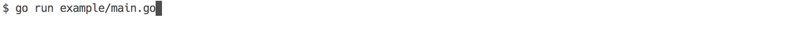

# UILive 

[](https://godoc.org/github.com/Adaendra/uilive)


> This project is a fork of [gosuri/uilive](https://github.com/gosuri/uilive) which hasn't been updated for years.

UILive is a go library for updating terminal output in realtime. It provides a buffered [io.Writer](https://golang.org/pkg/io/#Writer) that is flushed at a timed interval.

## Installation

```sh
$ go get -v github.com/Adaendra/uilive
```

## How to use it ?

Calling `uilive.New()` will create a new writer. To start rendering, simply call `writer.Start()` and update the ui by writing to the `writer`. Full source for the below example is in [example/single_line/single_line.go](example/single_line/single_line.go).

```go
writer := uilive.New()
// start listening for updates and render
writer.Start()

for i := 0; i <= 100; i++ {
  fmt.Fprintf(writer, "Downloading.. (%d/%d) GB\n", i, 100)
  time.Sleep(time.Millisecond * 5)
}

fmt.Fprintln(writer, "Finished: Downloaded 100GB")
writer.Stop() // flush and stop rendering
```

The above will render



### All examples
- [Single line](example/single_line/single_line.go)
- [Multi line](example/multi_line/multi_line.go)


